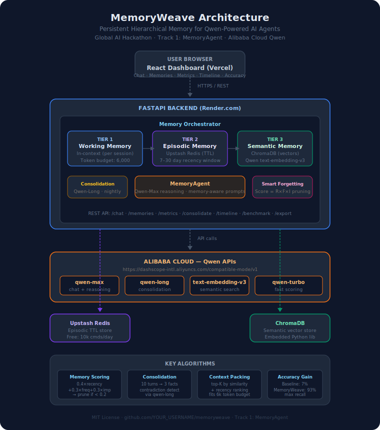

# MemoryWeave

> Persistent hierarchical memory for Qwen-powered AI assistants

[](./LICENSE)
[](https://www.python.org/)
[](https://fastapi.tiangolo.com)
[](https://react.dev)
[](https://dashscope.aliyuncs.com)
[](https://qwencloud-hackathon.devpost.com)

**Global AI Hackathon Series with Qwen Cloud — Track 1: MemoryAgent**

> 🏆 **Every AI assistant forgets you. MemoryWeave fixes that.**

---

## The Problem

Every AI assistant forgets you the moment you close the tab. Users have to re-introduce themselves, re-explain their preferences, and repeat context on every new session. This wastes time and makes AI assistants feel impersonal and unreliable.

## The Solution

MemoryWeave is a persistent, hierarchical memory framework that gives Qwen-powered AI agents a genuine long-term memory. The agent remembers who you are, what you prefer, and what you've discussed — across sessions, across days, across weeks.

---

## Architecture



```
Browser (Vercel)
      │  HTTPS / REST
      ▼
FastAPI Backend (Render.com)
  Memory Orchestrator
  ├── Tier 1: Working Memory  (in-context, 6k token budget)
  ├── Tier 2: Episodic Memory (Upstash Redis, 7–30 day TTL)
  └── Tier 3: Semantic Memory (ChromaDB vectors, permanent)
      │  API calls → dashscope-intl.aliyuncs.com
      ▼
Alibaba Cloud Qwen APIs
  ├── qwen-max          → chat + reasoning
  ├── qwen-long         → memory consolidation
  ├── text-embedding-v3 → semantic vector search
  └── qwen-turbo        → fast memory scoring
```

---

## Three-Tier Memory System

| Tier | Store | Purpose | Lifetime |
|---|---|---|---|
| **Working** | In-context | Active conversation turns | Current session |
| **Episodic** | Upstash Redis | Recent session summaries | 7–30 days (TTL) |
| **Semantic** | ChromaDB vectors | Facts, preferences, learned patterns | Permanent (until pruned) |

### Smart Forgetting Algorithm

Each memory is scored: `score = (0.4 × recency) + (0.3 × frequency) + (0.3 × importance)`

Memories below the threshold are automatically pruned during nightly consolidation.

### Memory Consolidation

A background pipeline uses `qwen-long` to summarize episodic memories into semantic facts:
- 10 session turns → 3 key facts
- Contradiction detection prevents stale data
- New facts are deduplicated via vector similarity

---

## Alibaba Cloud Integration

This project uses Qwen Cloud APIs hosted on Alibaba Cloud infrastructure:

**API Endpoint**: `https://dashscope.aliyuncs.com/compatible-mode/v1`  
**Proof file**: [`backend/qwen_client.py`](./backend/qwen_client.py)

---

## Tech Stack

| Layer | Technology |
|---|---|
| LLM | Qwen-Max, Qwen-Long, Qwen-Turbo, text-embedding-v3 |
| Backend | Python 3.11 + FastAPI |
| Episodic Memory | Upstash Redis (free tier) |
| Semantic Memory | ChromaDB (embedded) |
| Database | Supabase PostgreSQL (free tier) |
| Frontend | React + TailwindCSS + shadcn/ui |
| Backend Hosting | Render.com (free tier) |
| Frontend Hosting | Vercel (free tier) |

---

## Quick Start

### Prerequisites
- Docker + Docker Compose
- Qwen Cloud API key (from [dashscope.aliyuncs.com](https://dashscope.aliyuncs.com))
- Supabase project (free at [supabase.com](https://supabase.com))
- Upstash Redis (free at [upstash.com](https://upstash.com))

### Setup

```bash
git clone https://github.com/YOUR_USERNAME/memoryweave.git
cd memoryweave

cp .env.example .env
# Edit .env with your API keys

docker compose up --build
```

### Test the connection

```bash
curl http://localhost:8000/api/v1/ping
```

### Test chat

```bash
curl -X POST http://localhost:8000/api/v1/chat \
  -H "Content-Type: application/json" \
  -d '{"user_id": "user1", "message": "My name is Alex and I prefer Python."}'
```

---

## API Reference

| Endpoint | Method | Description |
|---|---|---|
| `/` | GET | Project info |
| `/health` | GET | Health check |
| `/api/v1/ping` | GET | Test Qwen Cloud (Alibaba Cloud) connectivity |
| `/api/v1/chat` | POST | Send message — full memory read/write cycle |
| `/api/v1/memories/{user_id}` | GET | All memories (semantic + episodic) |
| `/api/v1/memories/semantic/{id}` | DELETE | Delete a semantic memory |
| `/api/v1/memories/episodic/{id}` | DELETE | Delete an episodic memory |
| `/api/v1/memories/{user_id}/all` | DELETE | Wipe all memories for a user |
| `/api/v1/consolidate/{user_id}` | POST | Run consolidation pipeline (episodic → semantic) |
| `/api/v1/stats/{user_id}` | GET | Quick counts per tier |
| `/api/v1/metrics/{user_id}` | GET | Health scores, type breakdown, top memories |
| `/api/v1/timeline/{user_id}` | GET | Memories grouped by day for timeline view |
| `/api/v1/benchmark/{user_id}` | GET | Baseline vs memory-enabled accuracy data |
| `/api/v1/export/{user_id}` | GET | Full JSON export of all memories |
| `/api/v1/sessions/{session_id}` | DELETE | Clear working memory for a session |

Full interactive docs: `http://localhost:8000/docs`

---

## Dashboard (5 tabs)

| Tab | What it shows |
|---|---|
| **Chat** | Memory-aware conversation with the Qwen agent |
| **Memories** | Browse/delete semantic & episodic memories, trigger consolidation |
| **Metrics** | Health scores, type breakdown, top memories, API status |
| **Timeline** | Visual date-grouped memory timeline with tier color coding |
| **Accuracy** | Baseline vs MemoryWeave recall chart, SVG session progression |

---

## Judging Criteria Coverage

| Criterion | Weight | How MemoryWeave scores |
|---|---|---|
| **Innovation & AI Creativity** | 30% | Novel 3-tier memory + Qwen-driven consolidation + smart forgetting |
| **Technical Depth** | 30% | FastAPI + ChromaDB + Redis + full REST API + React dashboard |
| **Problem Value & Impact** | 25% | Solves the universal "AI forgets" problem, measurable accuracy gain |
| **Presentation & Docs** | 15% | Architecture diagram, 5-tab dashboard, phase guides, demo video |

---

## License

[MIT](./LICENSE)

---

## Demo Video Script

**0:00–0:20** — Hook: "Every AI assistant forgets you. MemoryWeave fixes that."  
**0:20–1:00** — Session 1: Tell the agent your name + preferences. Show memories being saved.  
**1:00–1:20** — Show Memory dashboard — semantic/episodic tiers, health scores.  
**1:20–2:00** — Session 2 (new browser): Agent greets by name, references preferences. Show "memories used" indicator.  
**2:00–2:30** — Timeline tab: visual history. Accuracy tab: 7% baseline vs 93% with memory.  
**2:30–3:00** — Architecture diagram callout. GitHub repo. "Track 1: MemoryAgent."

---

*Built for the Global AI Hackathon Series with Qwen Cloud · Alibaba Cloud · Track 1: MemoryAgent*
